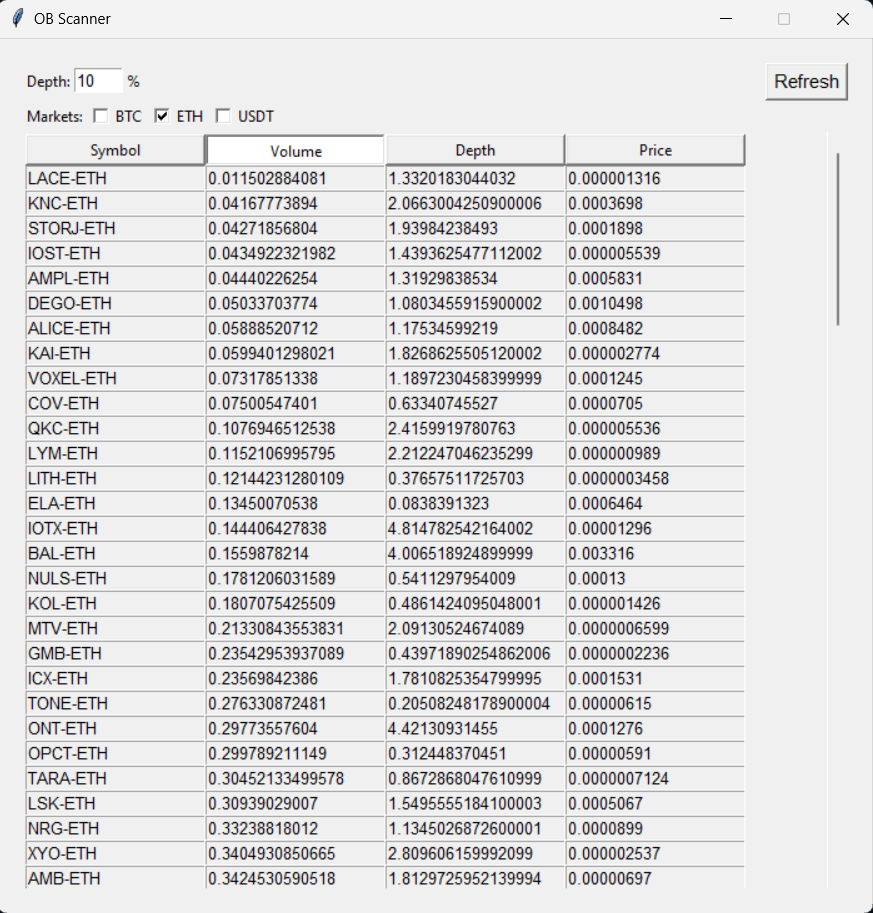

## Order book scanner

This tool provides key information about trading pairs, including their 24-hour volume, current price, and the cumulative size of their order book's bid side at a given depth.

This scanner is particularly useful for identifying trading pairs with "thin" order books, where a market sell order could potentially trigger a flash crash in the price.

Supported exchanges:

-   KuCoin (spot markets)

Supported markets:

-   ETH
-   BTC
-   USDT

## Demo

-   The entries can be sorted by the different columns ascendingly.
-   The values are displayed in the quote asset.

### How to run

1. Install the packages: `pipenv install`
2. Input your exchange API keys into the `secrets.json` file
3. Start shell: `pipenv shell`
4. Run the script: `python main.py`
5. Configure the scanner (depth and markets)
6. Click "Refresh" and wait for the results
